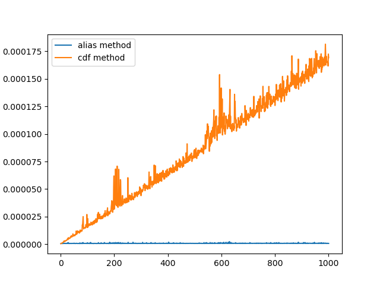
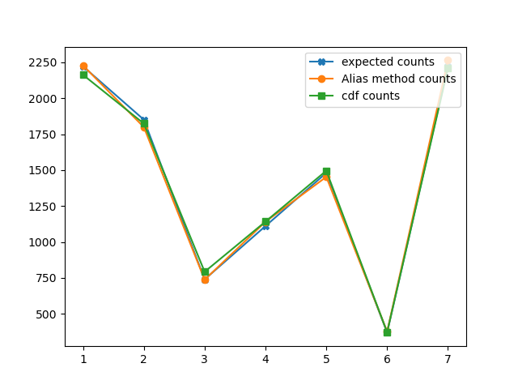

# Advanced Monte Carlo methods
This is a repository containing my assignments for Advanced Monte Carlo Methods course.

## Exercise 1

Write a sampler that samples from a discrete probability distribution based on:
- cumulative distribution function
- alias method

### Usage:

To create `comparison.png` plot:
```bash
python exercise1.py compare <min_classes> <max_classes>
```

For example `python exercise1.py compare 1 10000` will create a following plot:



It will take roughly 18 seconds to create this plot.

Looking at this plot it is clear that cdf method takes linear time relative to the
number of classes, whereas Alias method takes constant (O(1)) time relative to the number of classes
(the length of probability vector).

It is worth noting that Alias method takes O(n) preprocessing time, whereas cdf method in principle doesn't
(although in this implementation the intervals are sorted, so the "biggest" is checked first.)

To create a comparison between each method in terms of their validity
(i.e. if the method's results are roughly the same and consistent with the
probability vector specified) use the following script call:
```bash
python exercise1.py sample <n_classes> <n_samples>
```

For example following call: `python exercise1.py sample 4 10000` will output this:
```python
Class 1
        Probability: 0.222222
        Expected count: 2222
        Alias method count: 2228
        cdf method count: 2163
Class 2
        Probability: 0.185185
        Expected count: 1851
        Alias method count: 1799
        cdf method count: 1824
Class 3
        Probability: 0.074074
        Expected count: 740
        Alias method count: 738
        cdf method count: 793
Class 4
        Probability: 0.111111
        Expected count: 1111
        Alias method count: 1141
        cdf method count: 1142
Class 5
        Probability: 0.148148
        Expected count: 1481
        Alias method count: 1453
        cdf method count: 1496
Class 6
        Probability: 0.037037
        Expected count: 370
        Alias method count: 377
        cdf method count: 373
Class 7
        Probability: 0.222222
        Expected count: 2222
        Alias method count: 2264
        cdf method count: 2209
```

It will also create a following image `sample.png`:


It's clear that both method sample from correct distribution.

#### Usage as a package:
```python
from exercise1 import Sampler, sample
import numpy as np

# using a class
sampler = Sampler(probabilities=[0.2, 0.2, 0.3, 0.1])
print(sampler.sample(n_samples=10, method="alias"))
print(sampler.sample(n_samples=10, method="cdf"))

# using a function
print(sample(n_samples=10, probabilities=[0.2, 0.2, 0.3, 0.1], method="alias"))
print(sample(n_samples=10, probabilities=[0.2, 0.2, 0.3, 0.1], method="cdf"))


# creating random probability vectors using this class (used in `compare` and `sample` scripts):

vector_length = 100
# just specifying a uniform distribution
prob_vector_sampler = Sampler([1/vector_length] * vector_length, initialize=True)
probs = np.array(prob_vector_sampler.sample(vector_length, method="alias"))
# the vector sums to one now, making it a valid pdf
probs = probs / np.sum(probs)
```

